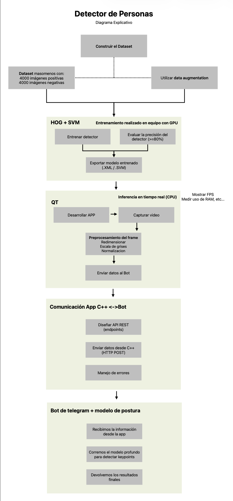

# People Detector System (HOG + SVM)

## Overview
Sistema de visión por computador para detección de personas en tiempo real
y análisis de postura humana, desarrollado como Proyecto Integrador Final
de la asignatura Visión por Computador.

## System Architecture
The following diagram illustrates the general workflow of the human detection system,
from dataset construction to communication with the Telegram bot.

## Technologies
- OpenCV C++
- Qt
- HOG + SVM
- Telegram Bot API
- PyTorch (pose estimation)

## Project Structure
- **docs/** -> Vive todo lo que no es codigo
- **app/** -> Qt + OpenCV
- **models/** -> Cargamos el modelo entrenado
- **data/** -> Pequeños ejemplos
- **integration/** -> El puente con el bot
- **scripts/** -> Utilidades (medir FPS, RAM, converiones)
- **experiments/** -> logs de pruebas, benchmarks, resultados crudos

## Current Status
- [x] Project structure
- [ ] Video capture
- [ ] Human detection
- [ ] Telegram integration
- [ ] Pose estimation